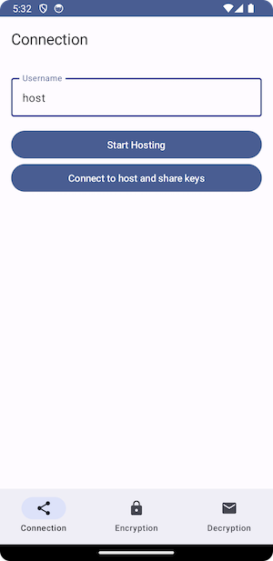
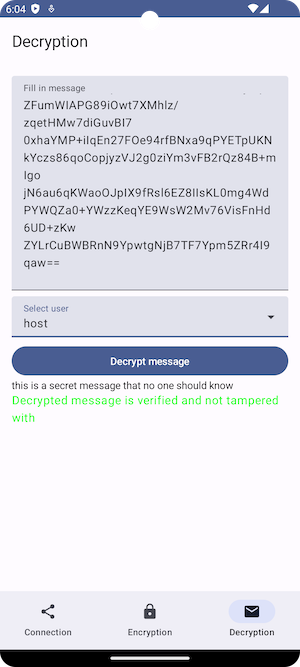

# Cleverbase Android Assessment

## Solution

We will be needing to connect two devices to transmit data between the devices, initially Bluetooth would be a better option but since I am testing using emulators, a network redirection will be used to communicate between the devices.
`User A` and `User B` will both generate a `Keypair` using RSA and sends their public key to the other user using sockets.
`User A` can now encrypt a message using the other `User B`'s public key and sign this message with their own private key.
`User B` can verify the message using `User A`'s public key
`User B` can decrypt the message using their own private key

## Architecture
I have chosen the following module architecture:

### Feature modules
- Exchange: Responsible for establishing a connection between two devices and sharing public keys.
- Message: Responsible for encrypting, signing, decrypting and verifying messages.

### Core Modules
- Crypto: Responsible for creating, storing and retrieving of the user’s public and private keys.
- Database: Responsible for creating, updating database and adding entries in database
- Data: Contains Repository for the features to access data from database (and potentially network)
- Model: Module for entities for database
- Ui: (not implemented but can be used to modularize ui elements to reuse elements)

## Design patterns used
- Dependency Injection Pattern
- Repository Pattern
- Singleton Pattern

## Improvements
- *Connectivity*: Connecting and sharing data between devices could be done through Bluetooth or a backend service
- *Authentication*: Having an authentication server would make it better to create relationships between users instead of manually adding usernames.
- *Onboarding*: Onboarding screen to explain the features (can be combined with authentication to login/register accounts)
- *Database*: Storing messages so older messages can be read later
- *QR Code*: Adding an option to generate a QR code of an encrypted signed message
- *Manual Decryption*: When a decrypted message is filled in, the app could go through all keys and try to decrypt the message automatically
- *Use Case Pattern*: To separate business logic from the code

## Bugs / TODO
- Add a connectivity status so user knows what is happening
- Close connection after final keys have been exchanged
- Improve UI

## Libraries used
- [Dagger Hilt](https://dagger.dev/hilt/)
- [Gradle Version Catalog](https://docs.gradle.org/8.1/userguide/platforms.html)
- [Jetpack Compose](https://developer.android.com/develop/ui/compose)
- [Kotlin DSL](https://docs.gradle.org/current/userguide/kotlin_dsl.html)
- [Room](https://developer.android.com/jetpack/androidx/releases/room)